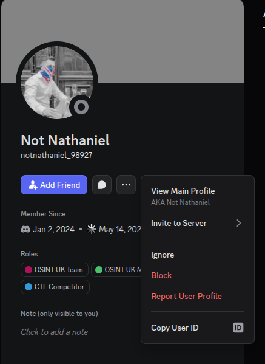
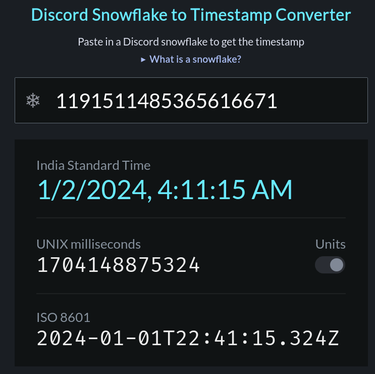
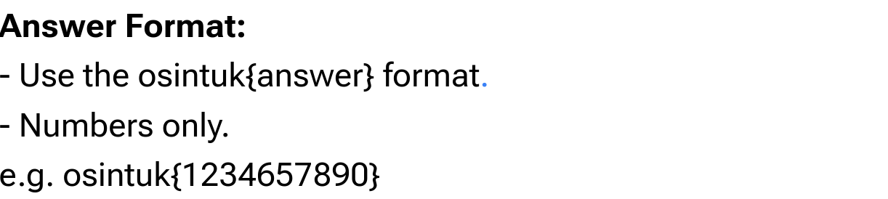

# OSINT UK CTF Challenge Writeup
**Operation:** Operation Cord  
**Target Focus:** Discord Platform Forensic & Application Auditing  
**Status:** Completed (4/4 Flags Captured)

---

## Challenge Summary
This challenge focused on platform-specific digital forensics targeting Discord infrastructure, including account metadata identification, cryptographic snowflake tracking, hidden web data extraction, and community intelligence analysis. All discovered intelligence vectors have been cross-referenced with the operational tracking dossier **Op_Cord.md**.

---

## 1. Discord Profile Account Enumeration
*   **Methodology:** Turned on "Developer Mode" in Discord settings. Located the user profile for "Nathaniel" and right-clicked the name to copy the unique user ID.
*   **Verification Reference:**  
    
*   **Flag Data:** 
    

    
Click to reveal flag

    <code>osintuk{1191511485365616671}</code>
    

---

## 2. Snowflake Cryptographic Timeline Analysis
*   **Methodology:** Took the Discord user ID from the first step and plugged it into an online Discord Snowflake converter tool. This revealed the exact account creation time, allowing the collection of the Unix timestamp in milliseconds.
*   **Verification Reference:**  
    
*   **Flag Data:** 
    

    
Click to reveal flag

    <code>osintuk{1704148875324}</code>
    

---

## 3. Hidden Application Layer Data Extraction
*   **Methodology:** Inspected the challenge page and zoomed into the text elements. Found a hidden hyperlink written in tiny font, which contained a Base64 string (`data:text/plain;base64,bXV0aW55bW9ja291dHNpbg==`). Decoded this text to reveal the hidden flag.
*   **Verification Reference:**  
    
*   **Flag Data:** 
    

    
Click to reveal flag

    <code>osintuk{mutinymockoutsin}</code>
    

---

## 4. Community Signature Discovery
*   **Methodology:** Looked at the core focus of the entire challenge, which centered on the specific community and its founders, making the final answer clear based on the hosting group.
*   **Verification Sources:** Core challenge architecture metrics
*   **Flag Data:** 
    

    
Click to reveal flag

    <code>osintuk{ukosintcommunity}</code>
    

---
